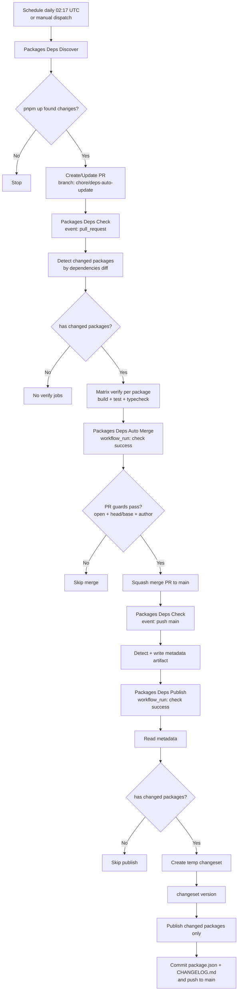

# Packages Auto Release Flow (Current)

## 1) 总览

当前仓库的自动发包链路由 4 个 workflow 组成：

1. `Packages Deps Discover`
   - 定时发现 `packages/*` 依赖更新并创建 PR。
2. `Packages Deps Check`
   - 检测哪些 package 的 `dependencies` 实际变更，并按包执行校验。
3. `Packages Deps Auto Merge`
   - 当依赖更新 PR 的 check 成功时自动合并。
4. `Packages Deps Publish`
   - 在变更进入 `main` 后，读取元数据并只发布变更包。

另有保底手动发布流程：

5. `Release (Manual)`
   - 仅手动触发，不参与自动链路。

## 2) 主流程图

## 3) 触发矩阵

| Workflow                   | Trigger                                                        | 主要作用              | 会触发下游                                                |
| -------------------------- | -------------------------------------------------------------- | --------------------- | --------------------------------------------------------- |
| `Packages Deps Discover`   | `schedule` + `workflow_dispatch`                               | 自动升级依赖并建 PR   | 触发 `Packages Deps Check` (PR)                           |
| `Packages Deps Check`      | `pull_request` + `push(main)` + path `packages/*/package.json` | 检测变更包并校验      | 触发 `Packages Deps Auto Merge` / `Packages Deps Publish` |
| `Packages Deps Auto Merge` | `workflow_run`(`Packages Deps Check`)                          | 自动合并机器人依赖 PR | 合并后触发 `Packages Deps Check` (push)                   |
| `Packages Deps Publish`    | `workflow_run`(`Packages Deps Check`)                          | 发布变更包并回写版本  | 无                                                        |
| `Release (Manual)`         | `workflow_dispatch`                                            | 手动兜底发布          | 无                                                        |

## 4) 每个 Workflow 的详细流程

### 4.1 `Packages Deps Discover`

文件：`.github/workflows/packages-deps-discover.yml`

1. 按天执行（`02:17 UTC`）或手动触发。
2. 安装依赖后运行：`pnpm -r --filter "./packages/**" up -L`
3. 检测变更范围：`packages/*/package.json` 与 `pnpm-lock.yaml`
4. 若有变更，使用 `peter-evans/create-pull-request` 创建/更新 PR：
   - 分支：`chore/deps-auto-update`
   - 标题：`chore(deps): auto update package dependencies`
   - 目标：`main`

### 4.2 `Packages Deps Check`

文件：`.github/workflows/packages-deps-check.yml`

1. 触发于：
   - PR 改动 `packages/*/package.json`
   - push 到 `main` 且改动 `packages/*/package.json`
2. `detect` job：
   - 解析 base SHA（PR 基准或 push 前 SHA）。
   - 调用 `scripts/release/detect-deps-changes.mjs`：
     - 输出 `has_changes`
     - 输出 `changed_matrix`
     - 输出 `changed_names`
3. 若是 `push` 事件：
   - 调用 `scripts/release/write-run-metadata.mjs`
   - 上传 artifact：`packages-deps-metadata`
4. `verify` job（matrix）：
   - 仅在 `has_changes == true` 时执行。
   - 对每个变更包执行：
     `pnpm turbo run build test typecheck --filter=<package-name>`

### 4.3 `Packages Deps Auto Merge`

文件：`.github/workflows/packages-deps-automerge.yml`

1. 监听 `Packages Deps Check` 的 `workflow_run`。
2. 仅在以下条件满足时尝试自动合并：
   - 上游结论 `success`
   - 上游事件是 `pull_request`
   - head branch 为 `chore/deps-auto-update`
   - head repo 是当前仓库
3. 运行前再次校验：
   - PR 状态是 `OPEN`
   - `head == chore/deps-auto-update`
   - `base == main`
   - `author == github-actions[bot]`
4. 通过后执行：
   `gh pr merge --squash --delete-branch`

### 4.4 `Packages Deps Publish`

文件：`.github/workflows/packages-deps-publish.yml`

1. 监听 `Packages Deps Check` 的 `workflow_run`。
2. 仅在以下条件执行发布：
   - 上游结论 `success`
   - 上游事件是 `push`
   - 上游分支是 `main`
3. `prepare` job：
   - 下载上游 run 的 artifact `packages-deps-metadata`
   - 调用 `scripts/release/read-run-metadata.mjs`
   - 输出 `has_changes` 与 `changed_matrix`
4. `publish` job：
   - 仅当 `has_changes == true`。
   - 调用 `scripts/release/create-temp-changeset.mjs`
   - 执行 `pnpm changeset version`
   - 调用 `scripts/release/publish-changed-packages.mjs` 按包发布
   - 提交并推送：
     - `packages/*/package.json`
     - `packages/*/CHANGELOG.md`

## 5) 脚本契约（输入/输出）

目录：`scripts/release/`

1. `detect-deps-changes.mjs`
   - Input: `BASE_SHA`
   - Output (`GITHUB_OUTPUT`): `has_changes`, `changed_matrix`, `changed_names`

2. `write-run-metadata.mjs`
   - Input: `HAS_CHANGES`, `CHANGED_MATRIX`
   - Output file: `.release-metadata/metadata.json`

3. `read-run-metadata.mjs`
   - Input file: `.release-metadata/metadata.json`
   - Output (`GITHUB_OUTPUT`): `has_changes`, `changed_matrix`

4. `create-temp-changeset.mjs`
   - Input: `CHANGED_MATRIX`
   - Output: `.changeset/packages-deps-<run-id>.md`

5. `publish-changed-packages.mjs`
   - Input: `CHANGED_MATRIX`
   - Action: 逐个执行 `pnpm --filter <name> publish --access public --no-git-checks`

## 6) 关键前置条件

1. `GITHUB_TOKEN` 需要具备：
   - 创建 PR 权限
   - 合并 PR 权限
   - 推送版本提交到 `main` 权限
2. npm 发布能力可用（当前走 npm registry + provenance）。
3. 分支保护规则需允许机器人按上述策略合并和推送。

## 7) 常见分支与行为说明

1. 没有发现依赖更新：
   - `Packages Deps Discover` 直接结束，不创建 PR。
2. 发现更新但 `dependencies` 未变化（理论较少见）：
   - `Packages Deps Check` 的 `verify` 不执行。
3. `verify` 失败：
   - 不会自动合并，不会触发发布。
4. 自动合并成功后：
   - 触发 `push main` 的 check，再由 publish 执行发布。

## 8) 手动运维入口

1. 手动触发依赖扫描：
   - 运行 `Packages Deps Discover` 的 `workflow_dispatch`
2. 手动兜底发布：
   - 运行 `Release (Manual)` 的 `workflow_dispatch`
3. 暂停自动链路：
   - 临时禁用 `Packages Deps Discover` 或 `Packages Deps Auto Merge`
